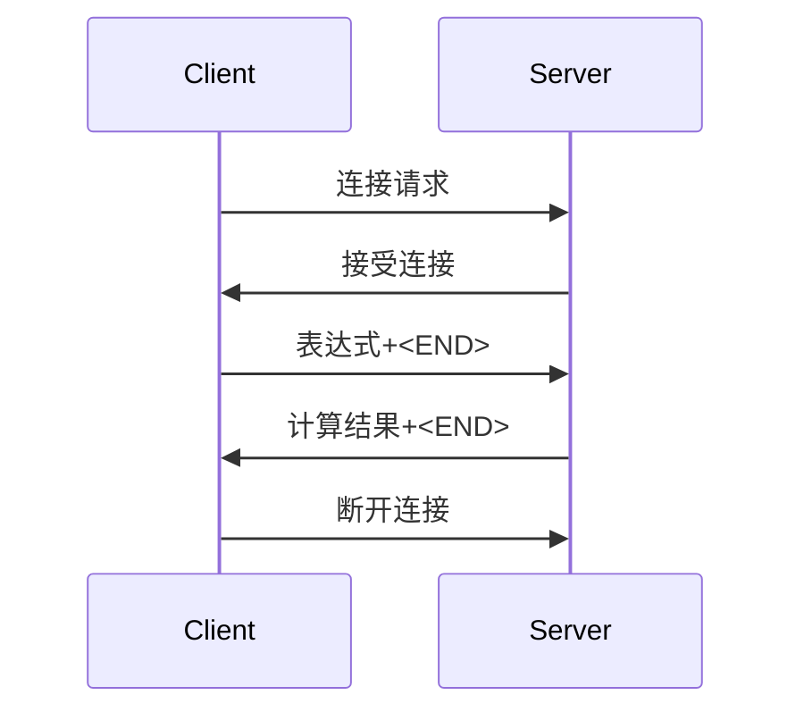

# 科学计算服务器文档

## 一、项目概述

**项目名称**：科学计算服务器  
**功能特点**：
- 提供数学表达式解析和计算服务
- 支持TCP协议通信（默认端口65433）
- 支持科学计算功能（三角函数、对数、阶乘等）
- 支持错误处理和结果格式化

## 二、核心功能

### 1. 表达式解析与计算
- **支持运算符**：`+`, `-`, `*`, `/`, `^`, `%`, `!`（阶乘）
- **支持函数**：
  - 三角函数：`sin`, `cos`, `tan`
  - 反三角函数：`asin`, `acos`, `atan`
  - 其他函数：`sqrt`, `log`（10为底）, `ln`（自然对数）
- **支持常量**：`pi`（圆周率）, `e`（自然常数）
- **支持括号**：`()`用于改变运算优先级
- **支持负数**：支持一元负号表示负数（如`-5`）

### 2. 表达式格式
- **输入要求**：
  - 不区分大小写（自动转换为小写）
  - 支持空格（自动忽略）
  - 必须以`<END>`标记结束
- **有效输入示例**：
  - `2+3*4<END>`
  - `sin(45)<END>`
  - `2^(3+1)<END>`
  - `5!<END>`
  - `log(100)<END>`

### 3. 结果格式化
- **输出规则**：
  - 整数结果：去除小数部分（如`5.0`→`5`）
  - 小数结果：保留最多7位有效数字，去除末尾0
    - `1.2300`→`1.23`
    - `0.12345678`→`0.1234568`
  - 极小值：绝对值<1e-15时返回`0`
  - 错误处理：返回可读的错误信息

## 三、网络接口

### 1. 通信协议
- **协议类型**：TCP
- **监听地址**：0.0.0.0（所有网络接口）
- **监听端口**：65433（可修改）
- **数据格式**：UTF-8编码的纯文本
- **结束标记**：`<END>`（字节序列`b'<END>'`）

### 2. 通信流程
1. 客户端建立TCP连接
2. 发送表达式（以`<END>`结尾）
3. 服务器计算并返回结果（以`<END>`结尾）
4. 关闭连接



### 3. 超时处理
- **接收超时**：100秒
- **超时处理**：
  - 接收数据时100秒无响应则中断
  - 自动处理不完整的数据传输

## 四、错误处理

### 1. 表达式错误
| 错误类型 | 示例 | 返回消息 |
|---------|------|---------|
| 无效字符 | `5$2` | `计算错误: 无效字符: $` |
| 未知标识符 | `abc(1)` | `计算错误: 未知标识符: abc` |
| 操作数不足 | `2^` | `计算错误: 操作数不足` |
| 无效阶乘 | `5.5!` | `数学错误: 结果未定义` |

### 2. 数学错误
| 错误类型 | 示例 | 返回消息 |
|---------|------|---------|
| 除零错误 | `5/0` | `数学错误: 结果无穷大` |
| 未定义结果 | `sqrt(-1)` | `数学错误: 结果未定义` |

### 3. 服务器错误
- **连接错误**：返回`服务器错误: [具体错误信息]`
- **内部错误**：返回通用错误消息并记录日志

## 五、核心类说明

### 1. ExpressionParser 类
**功能**：表达式解析和计算的核心类

#### 主要方法：
| 方法 | 参数 | 返回值 | 说明 |
|------|------|--------|------|
| `tokenize(formula)` | `formula`: 字符串表达式 | 令牌列表 | 将表达式分解为基本元素 |
| `parse(formula)` | `formula`: 字符串表达式 | 数值结果 | 解析并计算表达式 |
| `calculate()` | 无 | 无 | 执行栈顶操作 |

### 2. Operator 类
**功能**：封装运算符属性

#### 属性：
| 属性 | 类型 | 说明 |
|------|------|------|
| `symbol` | str | 运算符符号 |
| `precedence` | int | 运算优先级 |
| `num_operands` | int | 操作数个数 |
| `func` | function | 运算函数 |

### 3. 辅助函数
| 函数 | 功能 |
|------|------|
| `start_server()` | 创建并启动TCP服务器 |
| `safe_calculate(formula)` | 安全计算并格式化结果 |
| `main()` | 服务器主循环 |

## 六、启动与运行

### 启动命令：
```bash
python server.py
```

### 运行状态：
- 启动后显示：`科学计算服务器已启动，等待连接...`
- 连接日志：`已连接: (客户端IP, 端口)`
- 计算日志：`接收公式: ...` 和 `计算结果: ...`
- 关闭日志：`关闭连接: (客户端IP, 端口)`

## 七、测试用例

| 输入表达式 | 预期输出 | 实际测试 |
|-----------|---------|---------|
| `2+3*4<END>` | `14` | ✓ |
| `sin(30)<END>` | `0.5` | ✓ |
| `2^-1<END>` | `0.5` | ✓ |
| `5!<END>` | `120` | ✓ |
| `log(100)<END>` | `2` | ✓ |
| `5/0<END>` | `数学错误: 结果无穷大` | ✓ |
| `asin(1)<END>` | `90` | ✓ |